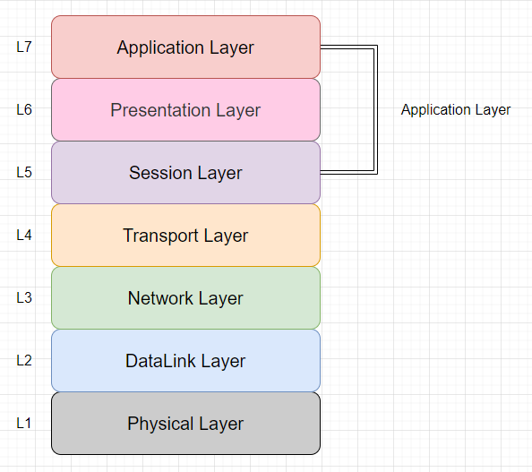
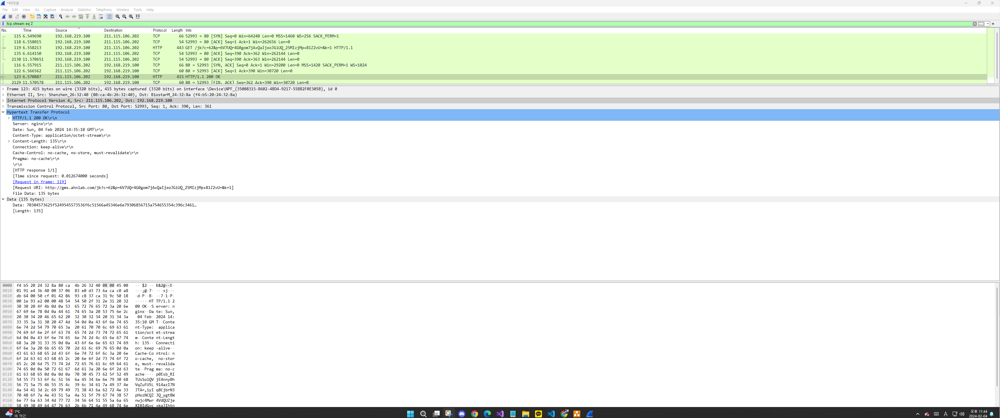

### OSI 7 Layer 설명

- OSI 7 Layer(Open System Interconnection)는 네트워크에서 통신이 일어나는 과정을 7단계로 나누어 표현한 국제 통신 표준 규약이다.
- 각 계층에서 수행하는 기능은 명확하게 구분되어있다.

### 계층을 나눈 이유는?

- 통신이 일어나는 과정을 단계별로 파악하기 위해 계층을 분리하여 관리한다.

### OSI 7 Layer

#### L1 물리 계층 (Physical Layer)

- 데이터를 전기적인 신호로 변환해서 주고받는 기능을 진행하는 계층이다.
- 장비
  - 통신 케이블
  - 허브

#### L2 데이터링크 계층 (DataLink Layer)

- 물리 계층으로 송/수신되는 데이터를 확인하고, 오류 없는 통신을 위한 기능을 진행하는 계층이다.
- MAC 주소를 통해 통신한다.
- 장비
  - 브릿지
  - 스위치

#### L3 네트워크 계층 (Network Layer)

- 데이터를 목적지까지 빠르고 안전하게 전달하는 기능을 진행하는 계층이다.
- 라우터를 통해 경로를 선택하여, IP 주소를 지정하고 경로에 따라 패킷을 전달한다.
- 장비
  - 라우터
- 프로토콜
  - ICMP
  - ARP
  - RARP
  - IP

#### L4 전송 계층 (Transport Layer)

- 두 호스트 시스템으로부터 발생하는 데이터의 흐름을 제공하는 계층이다.
- 프로토콜
  - TCP
  - UDP

#### L5 세션 계층 (Session Layer)

- 통신 시스템 사용자 간의 연결을 유지 및 설정하는 계층이다.

#### L6 표현 계층 (Presentation Layer)

- 세션 계층 간의 주고받는 인터페이스를 일관성있게 제공하는 계층이다.

#### L7 응용 계층 (Application Layer)

- 사용자가 네트워크에 접근할 수 있도록 서비스를 제공하는 계층이다.
- L5 ~ L7 계층을 응용 계층으로 묶어서 이야기하기도 한다.
- 프로토콜
  - telnet
  - FTP
  - DHCP
  - TFTP
  - HTTP
  - SMTP
  - DNS
  - SNMP

### 패킷 분석을 통한 OSI 7 Layer 이해

- OSI 7 Layer의 구조로 이루어진 패킷을 분석한다.
- 실제 통신중인 HTTP 패킷으로 분석을 진행한다.

### 통신이 이루어지는 과정

- 두 호스트가 통신하는 과정을 그림으로 설명한다.
